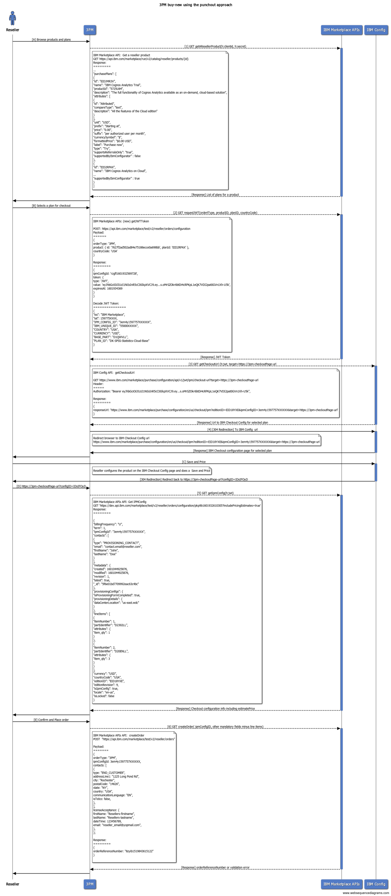

IPM Pivot

A reference implementation of Marketplace Portal showcasing integration with IBM Marketplace API for catalog, configuration & pricing and creating orders

### Run locally

- Clone repository on your local machine
- Make a copy of the `.env.stage` file and rename it as `.env`
- In the new .env file, fill in your `CLIENT_ID` and `CLIENT_SECRET` values
- Run `npm install` command
- Run `npm run build-client` command
- Run `npm run start` command
- Open "http://localhost:3000/partner/products" in your browser

### Local Development

For the cases when local changes are made to the application and you want to see them live, you need to enable hot reload of the application:
- After running `npm run start`, run the `npm run client` command in another terminal.
- If prompted to change the port, press the `Y` key
- After the client has started, a new tab will be opened with the application, in this case with the 3001 port - http://localhost:3001/partner/products

### Architecture

Detailed sequence diagram of the Buy-new Checkout implementation

